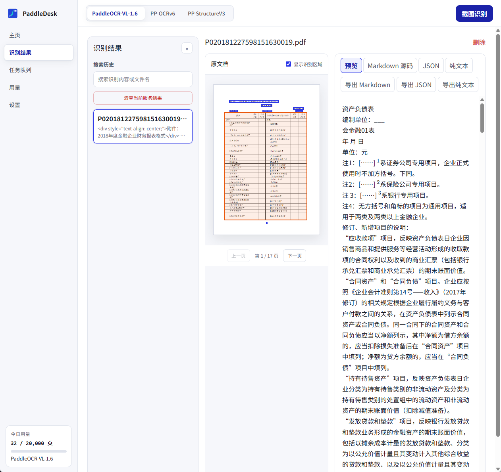
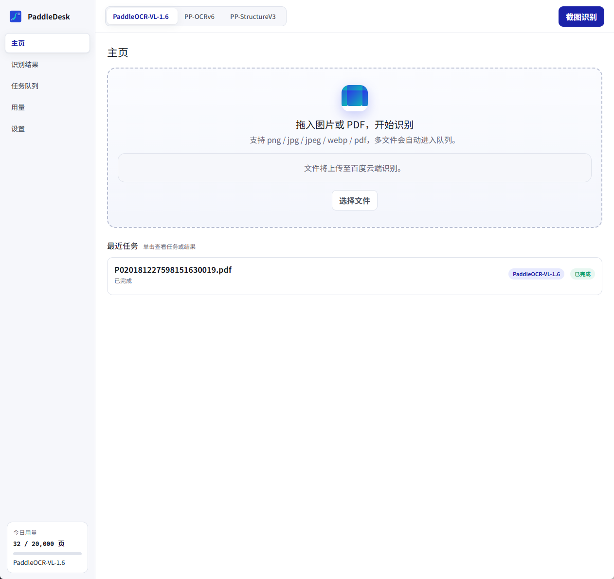
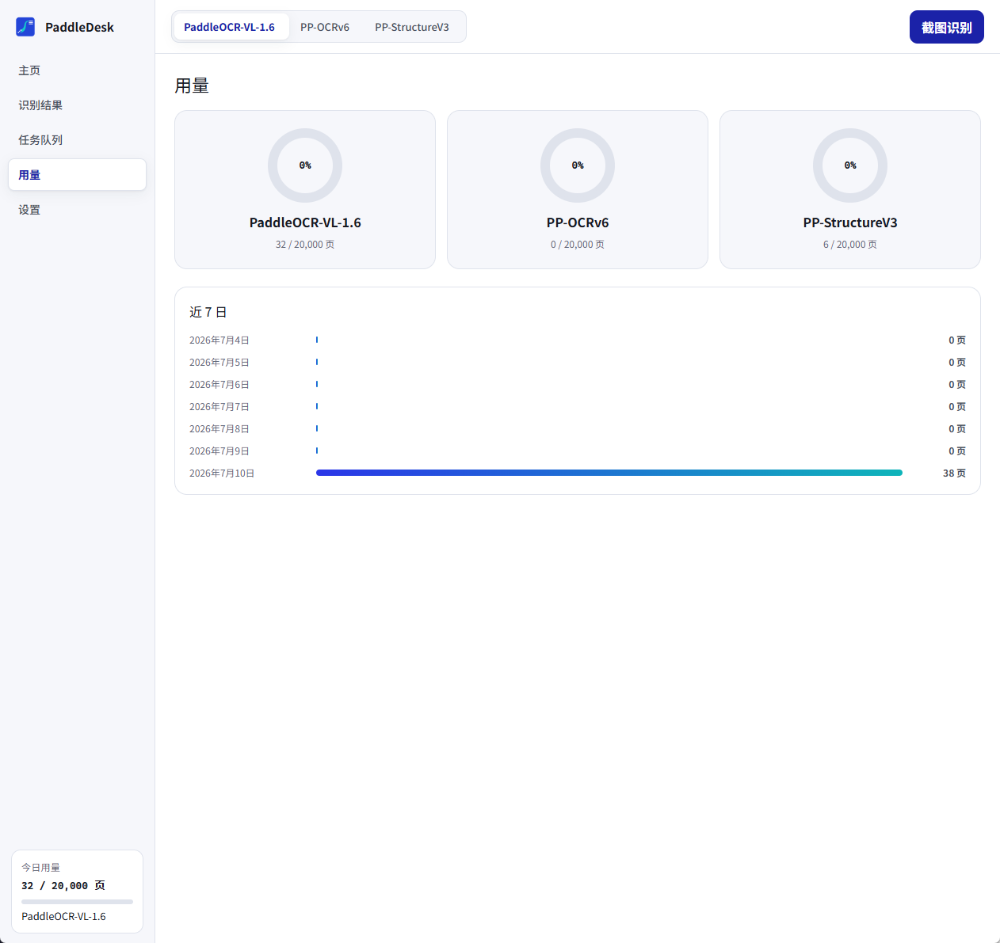

<div align="center">


# PaddleDesk

**PaddleOCR 官方云 API 的开源 Windows 桌面客户端**

复杂文档 · 结构化结果 · 轻量桌面体验

[](https://github.com/chengbuilds/PaddleDesk/actions/workflows/ci.yml)
[](LICENSE)
[](https://github.com/chengbuilds/PaddleDesk/releases)


[English](README.en.md) | 简体中文

</div>

---

PaddleDesk 接入百度 AI Studio 的三个 PaddleOCR 官方云服务，把复杂文档（表格、公式、多栏版面、手写）转换为可编辑、可导出的结构化结果。客户端轻量，不捆绑模型，识别精度随官方云端模型持续升级。

> **隐私提示**：图片和文档会上传至百度云端识别。若文件不能离开本机，请使用离线 OCR 工具。

## 预览



| 主页 · 拖放 / 截图 / 剪贴板识别 | 用量 · 三服务额度与近 7 日统计 |
| :---: | :---: |
|  |  |

## 支持的服务

| 服务 | 定位 | 适用场景 |
| --- | --- | --- |
| **PaddleOCR-VL-1.6** | 视觉语言大模型 | 复杂版面、手写体、图表混排文档 |
| **PP-OCRv6** | 通用文字识别 | 常规印刷体截图、单页图片的快速识别 |
| **PP-StructureV3** | 版面结构化 | 表格还原（CSV）、公式（LaTeX）、阅读顺序 |

每个服务独立配额（免费额度以 [AI Studio 官方页面](https://aistudio.baidu.com/paddleocr) 为准），应用内分服务统计用量。

## 功能

**识别与队列**
- 图片/PDF 拖放，多文件自动排队；失败重试、任务取消、应用重启后断点续跑
- `Ctrl+Alt+S` 全局截图识别，完成自动复制文字并发送系统通知
- 主页 `Ctrl+V` 直接识别剪贴板图片

**结果与导出**
- Markdown 预览 / 源码 / JSON / 纯文本四种视图；原文档逐页预览（PDF.js）与识别区域可视化
- 导出 Markdown、JSON、TXT；表格单独导出 CSV，公式一键复制 LaTeX
- SQLite FTS5 全文搜索历史结果

**桌面体验**
- 托盘常驻、开机自启、单实例、浅色/深色/跟随系统主题
- 简体中文 / English / 跟随系统，界面、错误提示、托盘与通知同步切换
- 首启向导引导获取并验证 Token，签名校验的自动更新

**隐私与安全**
- Token 只写入 Windows 凭据管理器，不进 SQLite、配置文件、日志或前端存储
- 隐私模式：保留任务生命周期与页数统计，不保存识别结果与可搜索历史
- 更新包必须通过内置公钥验签才会安装

## 安装

前往 [Releases](https://github.com/chengbuilds/PaddleDesk/releases) 下载最新版本：

| 文件 | 说明 |
| --- | --- |
| `PaddleDesk_x.y.z_x64_en-US.msi` | MSI 安装包 |
| `PaddleDesk_x.y.z_x64-setup.exe` | NSIS 安装器 |

要求 Windows 10/11 与 WebView2（Windows 11 自带）。也可以按「本地开发」章节自行构建。

## 快速上手

1. 首次启动阅读云端识别说明。
2. 打开 [PaddleOCR 官方页面](https://aistudio.baidu.com/paddleocr)，登录百度 AI Studio，按页面指引创建并复制 Access Token。
3. 在向导中粘贴验证；成功后 Token 只写入 Windows 凭据管理器。
4. 拖入文件、粘贴剪贴板图片，或按 `Ctrl+Alt+S` 截图识别。

## 架构

```
src-tauri/src/          Rust 核心
  api/        OcrService trait + 三服务实现 + 统一结果模型归一化
  queue/      任务队列、重试、断点续跑（状态落 SQLite）
  capture/    截图、全局热键（平台层，trait 隔离）
  storage/    SQLite（tasks / results / usage / settings，FTS5 全文搜索）
  export/     Markdown / JSON / TXT / CSV 写出
src/                    React + TypeScript 前端（views / components / stores / i18n）
```

前端与存储只消费统一的 `RecognitionResult` 模型，与上游三个服务的原始响应完全解耦。

## 本地开发

要求：Windows 10/11、WebView2、Node.js、pnpm、稳定版 Rust/MSVC 工具链。

```powershell
pnpm install
pnpm tauri dev
```

调试构建需要与当前应用数据完全隔离时，可先设置临时目录；正式构建会忽略此变量：

```powershell
$env:PADDLEDESK_TEST_DATA_DIR = Join-Path $env:TEMP "paddledesk-test-data"
pnpm tauri dev
```

验证命令：

```powershell
pnpm test
pnpm build
Set-Location src-tauri
cargo test
cargo clippy -- -D warnings
cargo fmt -- --check
```

CI 与单元测试只使用 fixture/wiremock，不发送真实 OCR 请求、不消耗额度；fixture 中的预签名下载链接已脱敏。

## 构建与签名更新

普通前端构建使用 `pnpm build`。Tauri 安装包和更新签名需要本机私钥：

```powershell
$env:TAURI_SIGNING_PRIVATE_KEY = "$HOME\.tauri\paddledesk.key"
$env:TAURI_SIGNING_PRIVATE_KEY_PASSWORD = ""
pnpm tauri build
Remove-Item Env:TAURI_SIGNING_PRIVATE_KEY, Env:TAURI_SIGNING_PRIVATE_KEY_PASSWORD
```

私钥永远不能提交到 Git。公开更新还需要在配置所指向的 GitHub 仓库发布已签名安装包、`.sig` 和 `latest.json`。正式发布前建议使用带密码的独立发布密钥，并把密钥与密码放入受保护的 CI secrets。

## 贡献

欢迎任何形式的贡献：

- 提交 [Issue](https://github.com/chengbuilds/PaddleDesk/issues) 报告 Bug 或提出功能建议
- 提交 [Pull Request](https://github.com/chengbuilds/PaddleDesk/pulls) 改进代码或文档，提交信息请遵循 Conventional Commits（`feat:` / `fix:` / `docs:` …）
- 提交前请确认 `pnpm test` 与 `cd src-tauri && cargo test` 全部通过

本项目由 [Claude Code](https://github.com/anthropics/claude-code) 协助开发。

## 许可证

本项目基于 [MIT License](LICENSE) 开源。

## 致谢

- **[PaddleOCR](https://github.com/PaddlePaddle/PaddleOCR)** — 感谢 PaddleOCR 团队在 OCR 领域的长期开源贡献。PaddleDesk 的全部识别能力都来自 PaddleOCR-VL、PP-OCRv6 与 PP-StructureV3 模型及其官方云服务，没有他们的工作就没有本项目。
- **[百度 AI Studio](https://aistudio.baidu.com/paddleocr)** — 提供 PaddleOCR 官方云 API 与免费额度。
- **[Tauri](https://tauri.app/)** — 轻量安全的桌面应用框架。
- **[PDF.js](https://mozilla.github.io/pdf.js/)** — 原文档页面预览。
- **[react-markdown](https://github.com/remarkjs/react-markdown)** 与 **[KaTeX](https://katex.org/)** — Markdown 与公式渲染。
